# Guide Utilisateur — Atelier Moto Pro

> Application de gestion d'atelier moto multi-atelier  
> Version : 2.3

---

## Table des matieres

1. [Connexion et roles](#1-connexion-et-roles)
2. [Dashboard](#2-dashboard)
3. [Prise de RDV](#3-prise-de-rdv)
4. [Planning](#4-planning)
5. [Dossiers atelier](#5-dossiers-atelier)
6. [Ponts, mecaniciens et absences](#6-ponts-mecaniciens-et-absences)
7. [Suivi live](#7-suivi-live)
8. [Clients et vehicules](#8-clients-et-vehicules)
9. [Fiches moto](#9-fiches-moto)
10. [Devis](#10-devis)
11. [Espace mecanicien](#11-espace-mecanicien)
12. [Facturation](#12-facturation)
13. [Administration](#13-administration)
14. [Cycle de vie d'un RDV](#14-cycle-de-vie-dun-rdv)
15. [Raccourcis et conseils](#15-raccourcis-et-conseils)
16. [Annexe visuelle](#16-annexe-visuelle)

---

## 1. Connexion et roles

### Se connecter

1. Ouvrir l'application dans le navigateur.
2. Saisir votre nom d'utilisateur et votre mot de passe.
3. Cliquer sur Connexion.

L'application verifie automatiquement la session et charge uniquement les sections autorisees pour votre role.

Capture de l'ecran de connexion :

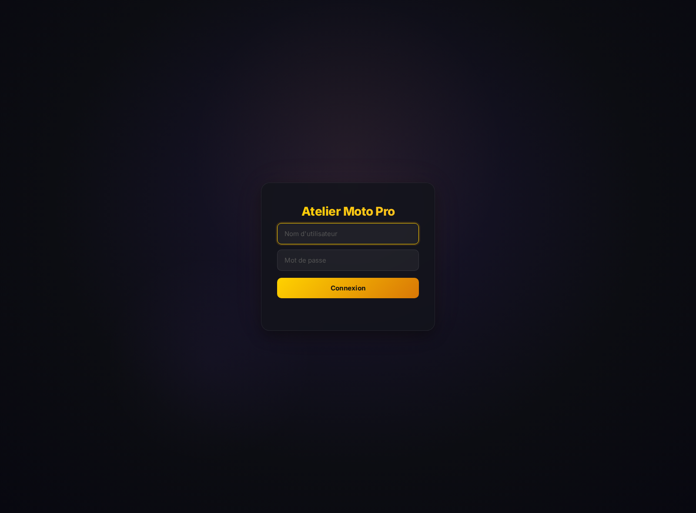

### Roles usuels

| Role | Usage principal |
|------|-----------------|
| Super Admin | gestion multi-atelier, catalogue global, droits |
| Admin | administration complete de l'atelier courant |
| Manager | pilotage atelier, planning, workshop, suivi |
| Receptionnaire | RDV, planning, dossiers atelier, clients, facturation |
| Service client | RDV, planning, clients, devis, dossiers sans encaissement complet |
| Mecanicien | espace mecanicien, planning, dossiers atelier, checkup |

### Changer d'atelier

Si votre role possede la permission `rdv.select_atelier` :

- un selecteur d'atelier apparait dans la prise de RDV
- un selecteur d'atelier apparait dans le planning
- les donnees sont rechargees dans le contexte de l'atelier choisi

### Navigation principale

Selon vos droits, la barre laterale peut afficher :

- Dashboard
- Prise de RDV
- Planning
- Ponts et mecaniciens
- Suivi live
- Clients et vehicules
- Dossiers atelier
- Fiches moto
- Devis
- Administration
- Espace mecanicien

---

## 2. Dashboard

Le dashboard est la vue d'ensemble de la journee atelier.

### Ce que vous y trouvez

- les KPI du jour
- les rendez-vous du jour
- l'etat des ponts en temps reel
- les indicateurs d'activite et d'occupation

### Informations affichees

- charge visible
- nombre de RDV du jour
- ponts disponibles ou occupes
- mecanicien et pont affectes par dossier
- statut courant de chaque RDV

### Usage conseille

Le dashboard sert a ouvrir la journee, verifier la charge, repérer les tensions et basculer rapidement vers le planning ou les dossiers atelier.

Capture du dashboard :

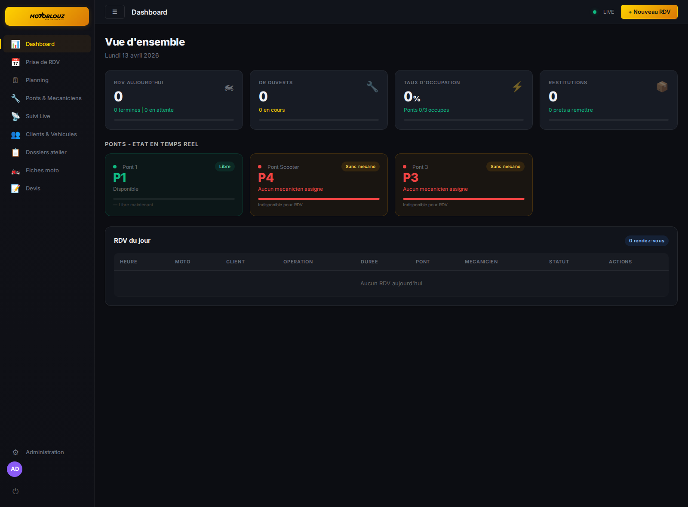

---

## 3. Prise de RDV

La prise de RDV interne reprend le meme parcours que le booking public, avec en plus la recherche dans la base clients.

Capture de la prise de RDV interne :

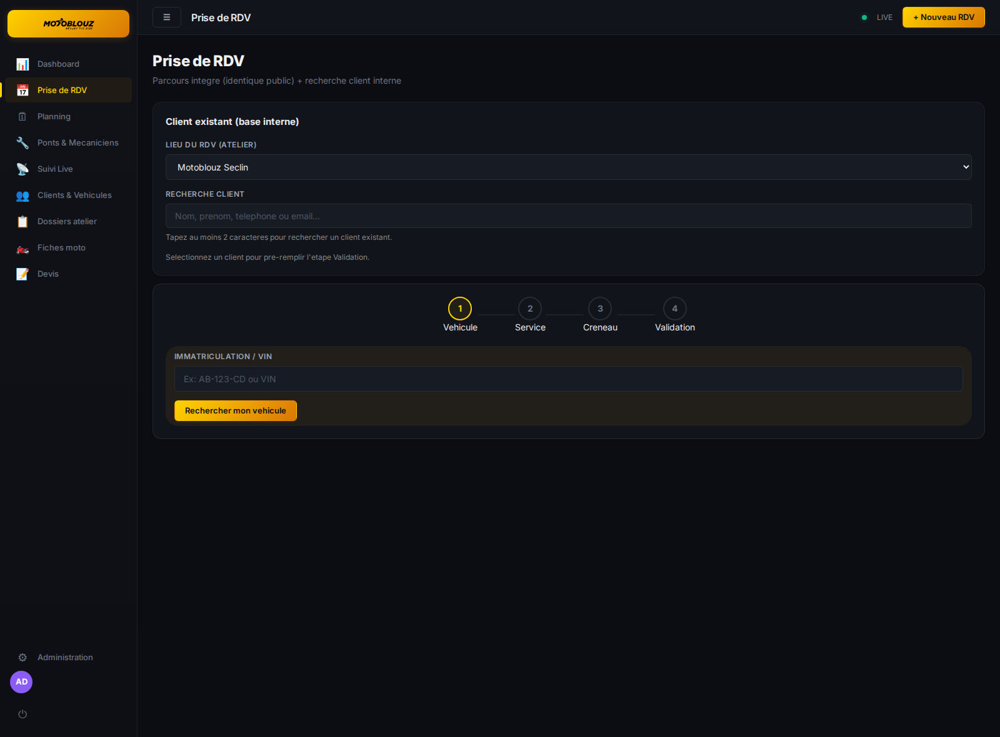

### Recherche client interne

Avant de lancer le parcours, vous pouvez rechercher un client existant par :

- nom
- prenom
- telephone
- email

La selection d'un client pre-remplit l'etape finale du formulaire.

### Assistant en 4 etapes

#### Etape 1 - Vehicule

- recherche par immatriculation ou VIN
- recuperation automatique des informations vehicule si connues
- saisie manuelle si necessaire
- aide a la saisie sur la marque et le modele
- choix du type de moto si l'information manque

#### Etape 2 - Service

- selection d'une ou plusieurs prestations
- calcul de la duree estimee
- calcul du total estime
- recapitulatif dynamique des lignes selectionnees

#### Etape 3 - Creneau

- affichage des semaines disponibles
- proposition des creneaux selon la duree
- affectation previsionnelle du pont et du mecanicien
- visualisation du creneau choisi avant validation

#### Etape 4 - Validation

- recapitulatif complet du RDV
- informations client
- remarques libres
- confirmation du RDV avec generation du dossier initial

### Multi-atelier

Si vous avez acces a plusieurs ateliers, verifiez le lieu du RDV avant validation.

Capture du parcours public de prise de RDV :

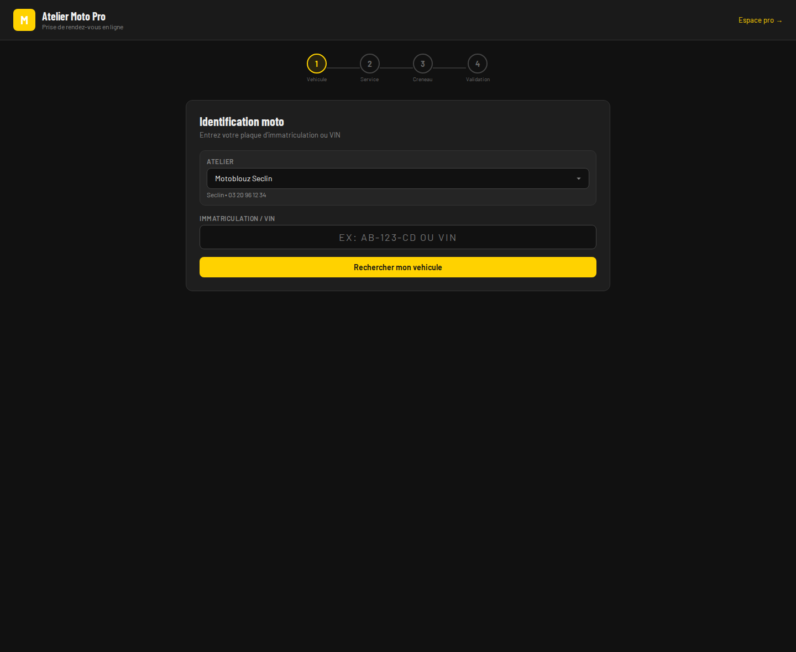

---

## 4. Planning

Le planning est la vue principale de pilotage atelier.

### Vue hebdomadaire

Le planning affiche :

- la semaine courante
- les blocs de RDV par jour et par heure
- les affectations pont / mecanicien
- les conflits detectes
- les RDV non affectes

### Indicateurs visibles

- charge visible
- nombre de conflits
- nombre de RDV sans affectation

### Actions rapides

| Action | Usage |
|--------|-------|
| Voir un RDV | cliquer sur un bloc |
| Creer un RDV | utiliser Nouveau RDV |
| Deplacer un RDV | glisser-deposer |
| Filtrer par mecanicien | activer les filtres mecaniciens |
| Changer de semaine | fleches precedent / suivant |
| Revenir a aujourd'hui | bouton Aujourd'hui |

### Controle metier

Le planning aide a identifier :

- conflits de pont
- conflits de mecanicien
- surcharge horaire
- dossiers non encore assignes

Capture du planning atelier :

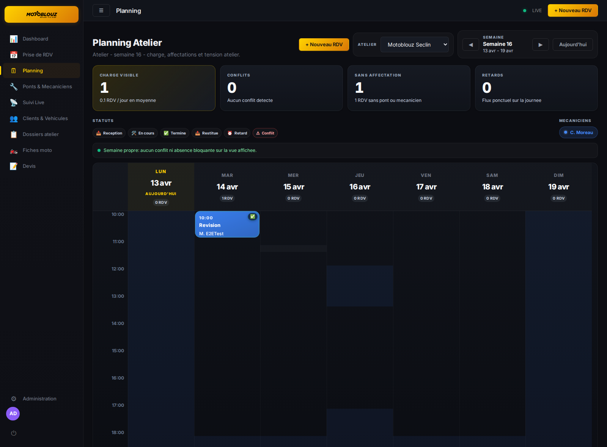

---

## 5. Dossiers atelier

La section Dossiers atelier centralise les RDV relies a un ordre de reparation et a leur suivi metier.

Capture des dossiers atelier :

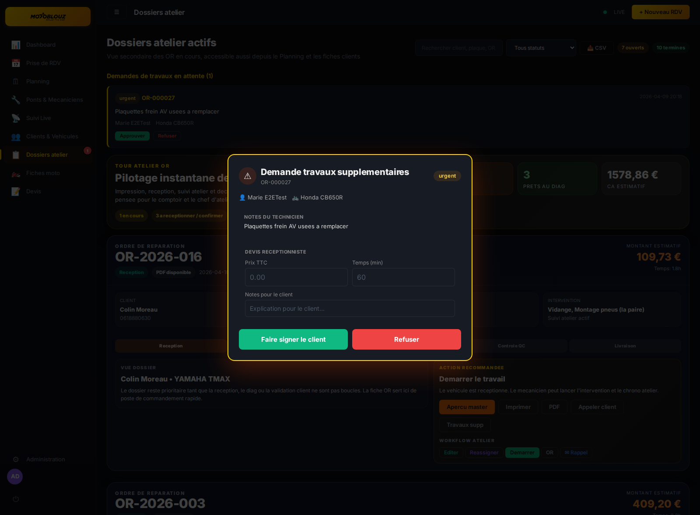

### Liste des dossiers

Chaque ligne peut afficher :

- numero d'OR
- client
- vehicule
- date et heure
- type d'intervention
- statut
- montant estime ou a chiffrer

### Actions disponibles

| Action | Description |
|--------|-------------|
| Apercu dossier | vue detaillee de l'ordre de reparation |
| PDF OR | ouverture du PDF securise |
| Export CSV | export de la liste des dossiers |
| Reception | check-in complet du vehicule |
| Travaux supplementaires | traitement des demandes additionnelles |
| Historique OR | consultation des OR lies au dossier |

### Reception enrichie

La reception permet de saisir :

- kilometrage
- points d'etat vehicule
- priorite
- niveau de carburant
- dommages carrosserie sur schema
- notes de schema
- lignes d'estimation
- photos
- signature client

Quand la signature client est enregistree, le dossier devient la reference atelier du vehicule pris en charge.

### Travaux supplementaires

Pendant l'intervention, un mecanicien peut declarer des travaux complementaires.

Le flux est le suivant :

1. le mecanicien cree une demande
2. une notification apparait dans Dossiers atelier
3. le receptionnaire ou le role autorise examine la demande
4. la demande est acceptee ou refusee
5. si besoin, une validation client est enregistree
6. un OR complementaire est rattache au RDV

### Historique de workflow

Le dossier conserve une trace des etapes metier du RDV. Cette timeline permet de comprendre qui a fait quoi et a quel moment.

---

## 6. Ponts, mecaniciens et absences

Cette section correspond au pilotage des ressources atelier.

### Onglet Ponts

Pour chaque pont, vous retrouvez :

- le statut courant
- le mecanicien attribue
- le nombre de RDV du jour
- le prochain passage planifie

### Onglet Mecaniciens

Pour chaque mecanicien, vous retrouvez :

- les specialites
- la couleur de planning
- la charge du jour
- les interventions affectees
- la disponibilite

### Onglet Temps

Cet onglet aide a comparer les temps d'intervention selon les prestations et les types de moto.

### Onglet Absences

Les absences permettent de planifier :

- conges
- indisponibilites
- formations
- autres motifs internes

Les absences sont prises en compte dans la lecture de charge atelier.

Capture de la gestion des ponts et mecaniciens :

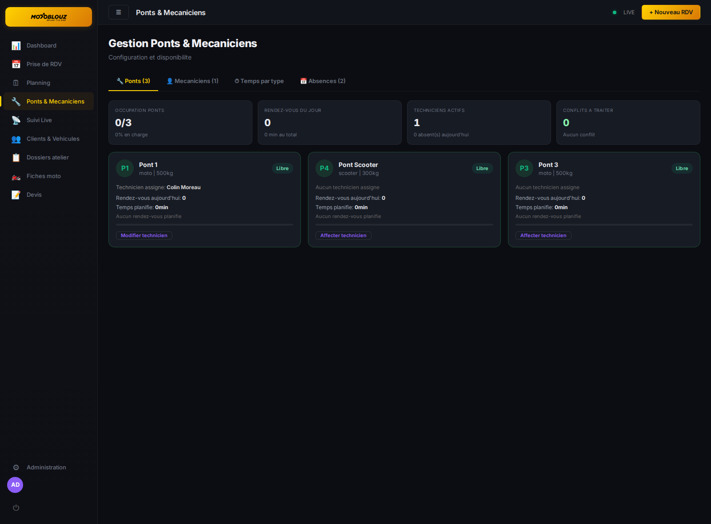

---

## 7. Suivi live

Le suivi live affiche l'activite de la journee par mecanicien.

### Ce que montre l'ecran

- une timeline par mecanicien
- les RDV non assignes
- les interventions en cours
- les demarrages imminents
- les retards detectes

### Alertes visibles

- retard sur un RDV non demarre
- demarrage imminent
- intervention en cours avec depassement de temps

### Progression atelier

Quand un travail est demarre, le suivi live compare :

- le temps estime
- le temps reel ecoule
- l'avancement apparent du dossier

Capture du suivi live atelier :

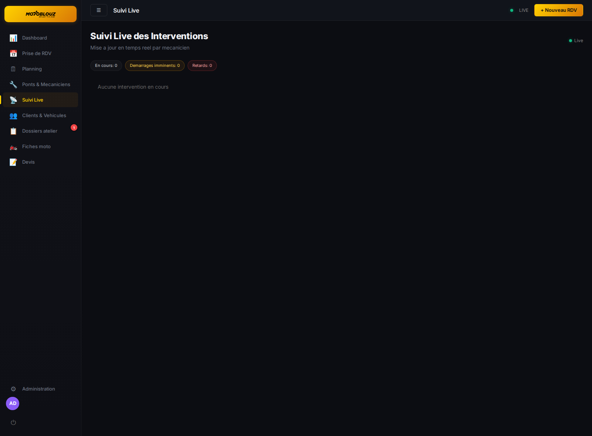

Capture du suivi client partage par lien :

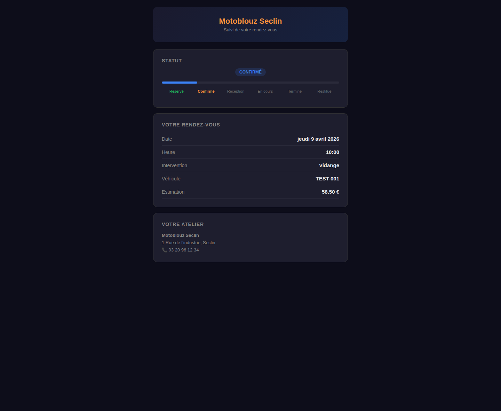

---

## 8. Clients et vehicules

La fiche client sert de memoire atelier et de point d'entree vers les motos et l'historique.

### Recherche client

La recherche prend en charge :

- nom
- prenom
- telephone
- email

### Donnees de la fiche client

La fiche peut afficher :

- coordonnees client
- adresse
- notes
- liste des vehicules
- historique des RDV
- chiffre d'affaires cumule
- dossiers atelier rattaches

### Actions disponibles

- creer un client
- modifier un client
- ajouter un vehicule
- supprimer un vehicule si autorise
- ouvrir un client depuis un autre ecran
- planifier un nouveau RDV

### Vehicules

Depuis la fiche client, vous accedez aux motos rattachees et a leur historique atelier.

Capture de la page Clients & vehicules :

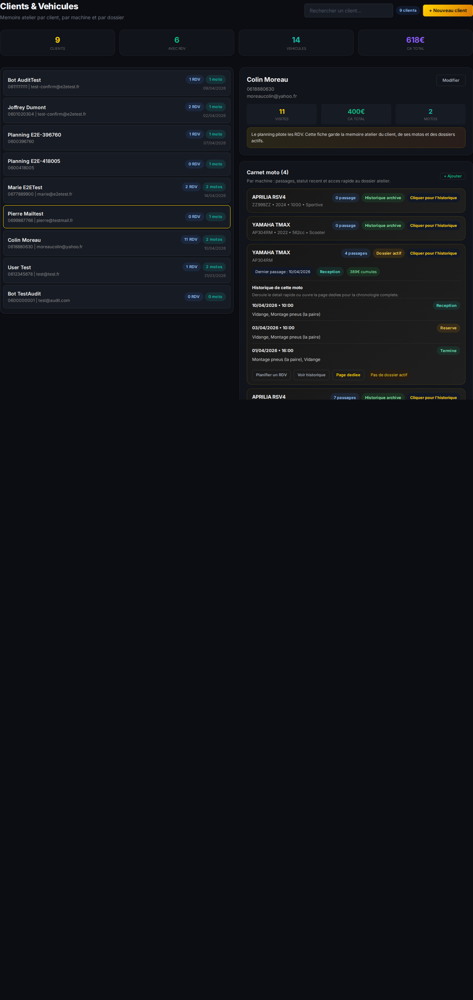

---

## 9. Fiches moto

La section Fiches moto interroge la base technique des motos.

### Usages

- rechercher une moto par marque
- filtrer par modele
- preciser l'annee si necessaire
- consulter les informations utiles a l'atelier

### Interet metier

Cette base facilite :

- la prise de RDV
- la selection des prestations
- la coherence des temps et tarifs
- la qualification correcte du vehicule

Capture des fiches moto :

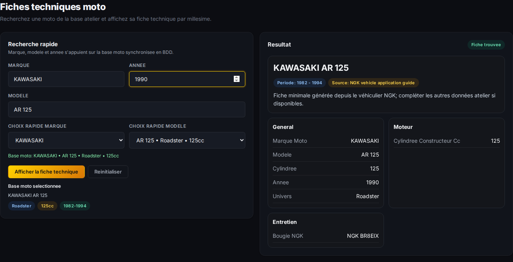

---

## 10. Devis

La section Devis couvre la creation, le suivi et la conversion en RDV.

### Contenu d'un devis

Un devis peut comprendre :

- client
- vehicule
- kilometrage
- notes client
- notes internes
- lignes de forfait main-d'oeuvre
- lignes de pieces
- lignes de main-d'oeuvre libre
- remise en pourcentage

### Statuts utilises

| Statut | Signification |
|--------|---------------|
| Brouillon | devis en preparation |
| Envoye | transmis au client |
| Accepte | accord client obtenu |
| Refuse | refuse par le client |
| Expire | non valide ou hors delai |
| Converti | transforme en RDV |

### Actions principales

- creer un devis
- filtrer par statut
- rechercher un devis
- ouvrir le detail
- envoyer un devis
- convertir un devis accepte en RDV
- supprimer un brouillon

### Conversion en RDV

Quand un devis est accepte, il peut etre transforme en rendez-vous tout en conservant les informations utiles du dossier.

Capture de la page Devis :

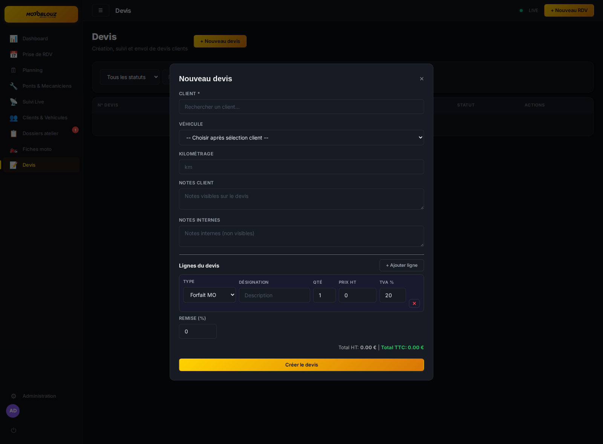

---

## 11. Espace mecanicien

L'espace mecanicien est concu pour un usage atelier, y compris sur tablette.

### Vue principale

L'ecran donne une vision directe sur :

- l'intervention en cours
- les dossiers prets a lancer
- les dossiers a receptionner
- les interventions terminees
- les retards de la journee

### Fonctions disponibles

- demarrer le travail
- suivre le timer live
- voir le client et le vehicule
- ouvrir l'OR
- remplir le checkup technicien
- declarer des alertes
- formuler des recommandations
- enregistrer les travaux effectues
- demander des travaux supplementaires

### Checkup 10 points

Le rapport technicien comprend notamment :

- carrosserie / visuel
- freinage
- pneus / pression
- eclairage / clignotants
- transmission
- niveau d'huile
- batterie
- chaine / courroie
- liquide de refroidissement
- filtre a air

### Fin d'intervention

Le mecanicien peut sauvegarder le rapport, puis terminer l'intervention avec le checkup associe.

Capture de l'espace mecanicien :

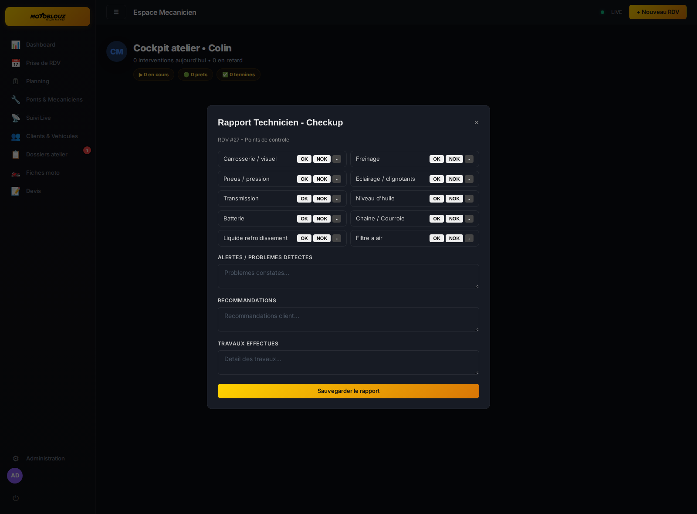

---

## 12. Facturation

La facturation s'appuie sur les RDV termines et les donnees du dossier atelier.

Le parcours de facturation est declenche depuis un dossier atelier ou un RDV eligible. Il ne correspond pas a une page dediee dans la navigation laterale actuelle.

Capture du point d'entree dossier atelier utilise avant facturation :


### Generer une facture

Depuis un RDV termine :

1. ouvrir la facturation
2. controler les lignes de MO et les pieces
3. verifier la TVA
4. appliquer une remise si necessaire
5. generer la facture

### Elements pris en charge

- temps facture
- taux horaire ou logique de forfait
- pieces
- TVA
- remise
- notes internes

### Encaissement

Les modes d'encaissement prevus incluent :

- carte bancaire
- especes
- cheque
- virement
- paiement differe

### Suivi facture

Selon les droits utilisateur, vous pouvez :

- consulter les factures liees aux RDV
- enregistrer un paiement
- telecharger le PDF
- transmettre la facture par email

> Le role service client peut etre limite sur la facturation et l'encaissement selon la configuration RBAC.

---

## 13. Administration

La section Administration est reservee aux roles d'encadrement et d'administration.

### Onglets principaux

| Onglet | Usage |
|--------|-------|
| Ateliers | creation, selection, bascule et edition des ateliers |
| Utilisateurs | comptes, roles, statut actif/inactif |
| Workshop | ponts, mecaniciens, organisation atelier |
| Configuration | informations atelier, logo, parametrage metier |
| Base moto | catalogue moto et referentiel technique |
| Prestations | catalogue et parametrage tarifaire |
| Roles et droits | permissions fines par role |

### Ateliers

La gestion multi-atelier permet notamment :

- creer un atelier
- modifier ses informations
- changer l'atelier actif
- charger un logo atelier

### Utilisateurs

La gestion des comptes permet :

- creer un login atelier
- attribuer un role
- rattacher un mecanicien a un compte
- desactiver ou supprimer un utilisateur selon les droits

### Roles et permissions

Les droits ne sont pas limites au role nominal. Ils peuvent etre ajustes finement via la gestion des permissions.

Capture de la page Administration :

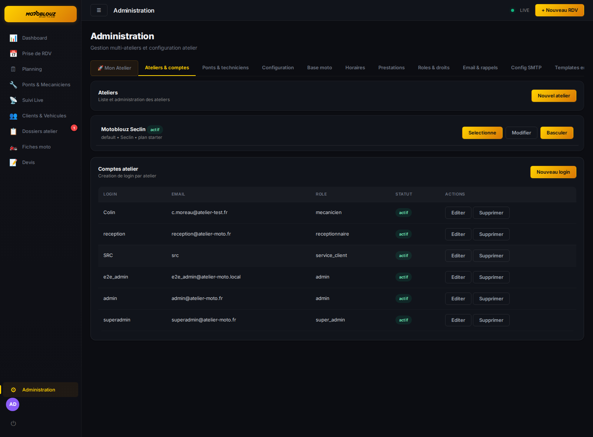

---

## 14. Cycle de vie d'un RDV

Le workflow principal suit les etapes suivantes :

```text
reserve / en_attente -> confirme -> reception -> en_cours -> termine -> restitue -> facture -> paye
                                \-> annule / non_presente
```

### Lecture des principaux statuts

| Statut | Signification |
|--------|---------------|
| reserve | RDV cree |
| en_attente | dossier en attente de validation ou d'action |
| confirme | RDV confirme |
| reception | vehicule receptionne, dossier atelier ouvert |
| en_cours | intervention demarree |
| termine | travail termine |
| restitue | vehicule rendu |
| facture | facture emise |
| paye | facture reglee |
| annule | RDV annule |
| non_presente | client absent |

### Transitions metier usuelles

| Transition | Action | Role habituel |
|------------|--------|---------------|
| Reserve -> Confirme | confirmer le RDV | receptionnaire / role autorise |
| Confirme -> Reception | prise en charge vehicule | receptionnaire |
| Reception -> En cours | demarrer le travail | mecanicien / role autorise |
| En cours -> Termine | cloturer l'intervention | mecanicien |
| Termine -> Restitue | remise du vehicule | receptionnaire |
| Restitue -> Facture | generer la facture | receptionnaire / admin |
| Facture -> Paye | encaisser | receptionnaire / admin |

### Cas particuliers

- annulation avec motif
- non presentation avec trace explicite
- travaux supplementaires au fil de l'eau
- OR complementaire archive avec le dossier principal

---

## 15. Raccourcis et conseils

| Conseil | Description |
|---------|-------------|
| Verifier l'atelier actif | important avant creation de RDV et travail planning |
| Utiliser la recherche client en amont | evite les doublons et pre-remplit la validation |
| Traiter la reception avant le demarrage atelier | garantit un OR exploitable et signe |
| Surveiller Dossiers atelier | les demandes de travaux supplementaires y remontent |
| Utiliser le suivi live en cours de journee | utile pour anticiper retards et non-assignes |
| Remplir le checkup mecanicien | alimente le dossier et facilite la restitution |
| Convertir les devis acceptes | permet de garder la continuite client et vehicule |
| Controler les permissions | certaines actions dependent du RBAC et non du seul role affiche |

---

## 16. Annexe visuelle

Cette annexe rassemble un apercu rapide de toutes les pages principales du parcours atelier et du parcours public.

### Connexion


### Dashboard


### Prise de RDV interne


### Planning


### Ponts et mecaniciens


### Dossiers atelier


### Suivi live atelier


### Clients et vehicules


### Fiches moto


### Devis


### Espace mecanicien


### Administration


### Prise de RDV publique


### Suivi public client


